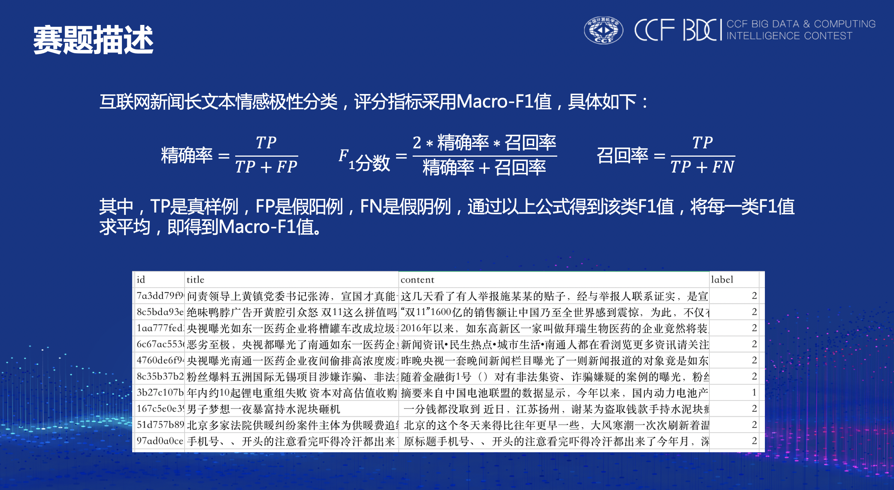
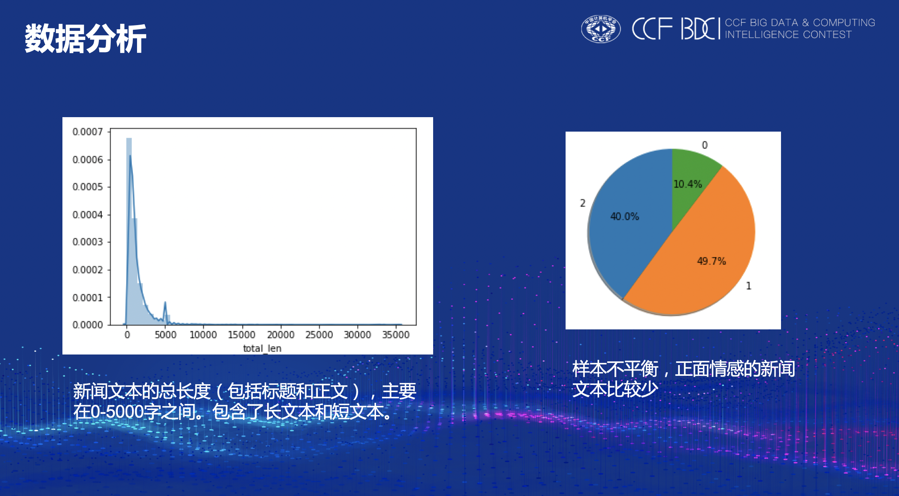
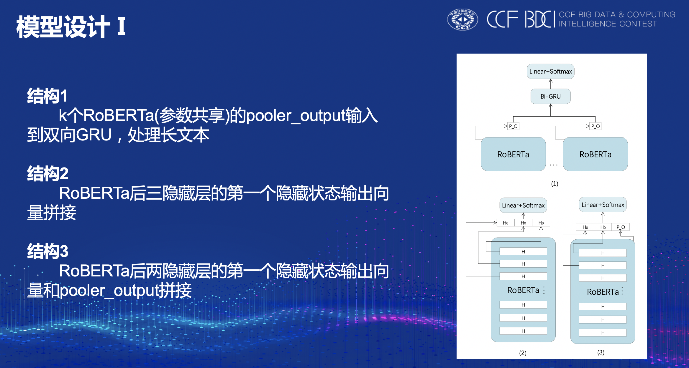
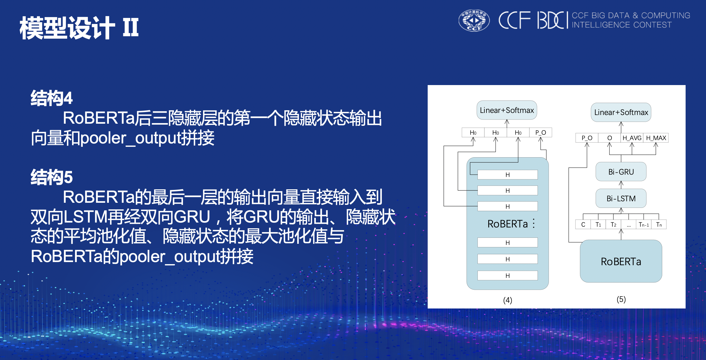
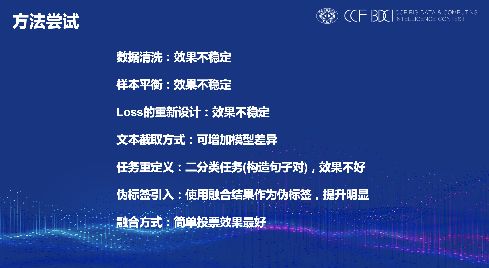
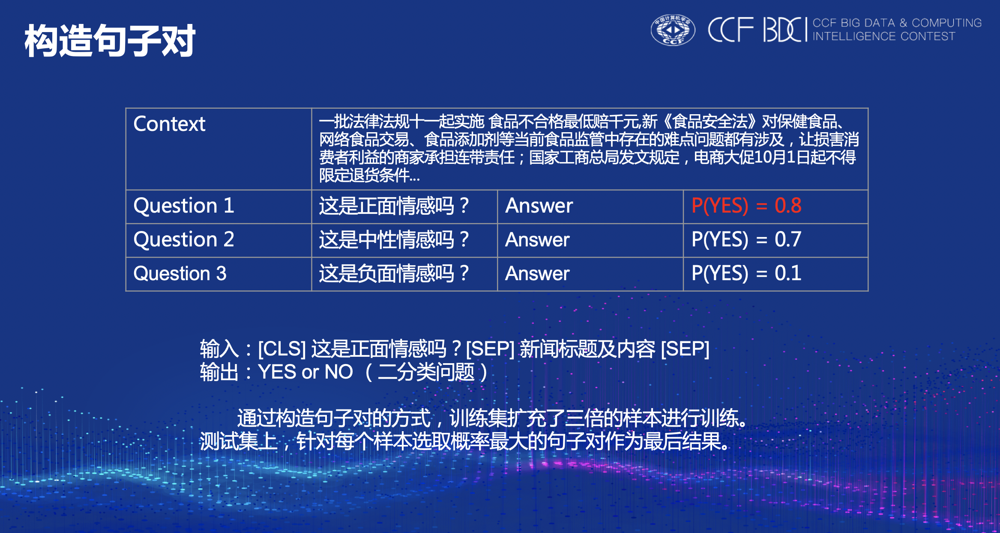
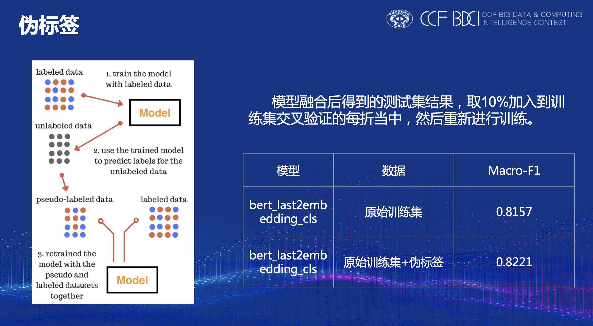
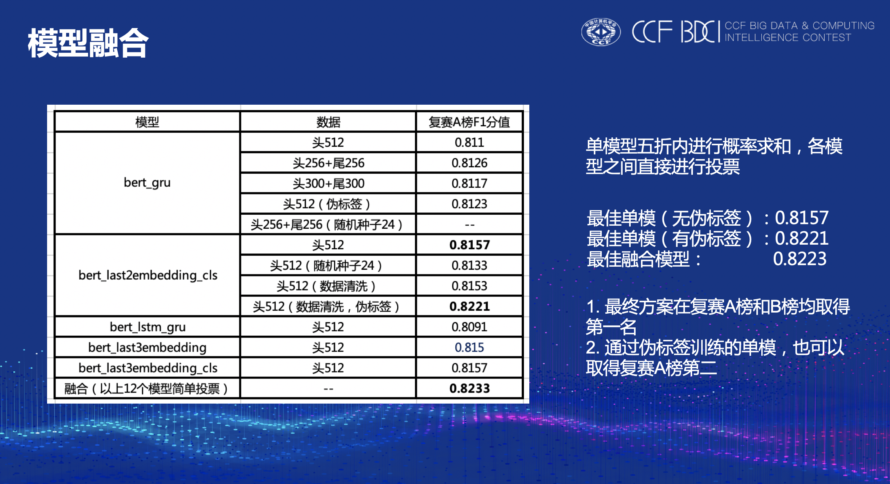
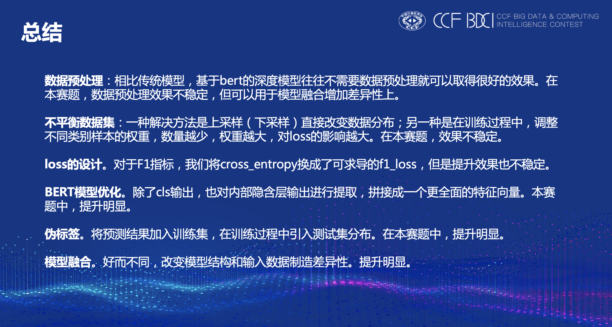

# CCF BDCI 2019 互联网新闻情感分析 复赛top1解决方案

队名：我们都上哈工深

比赛官网：[互联网新闻情感分析](https://www.datafountain.cn/competitions/350)

## 复现

本项目下共有三个文件夹，分别为**data**，**model**，**source**。
1. **data**文件夹下包含初赛和复赛的训练数据及复赛的测试数据（需官网下载）和数据处理代码。
2. **model**文件夹下包含运行的各个模型保存及预测的结果。
3. **source**文件夹下包含本次比赛的代码以及模型运行的jupyter notebook文件，共12个。
4. **复赛融合**文件夹下包含融合代码和融合结果。

复现详见"互联网新闻情感分析复现文档-我们都上哈工深.docx"

## 方案

句子对效果一般，最后没有采用。

## 最后

代码修改自[guoday的baseline](https://github.com/guoday/CCF-BDCI-Sentiment-Analysis-Baseline) ，预训练bert采用[哈工大RoBERTa-wwm-ext-large](https://github.com/ymcui/Chinese-BERT-wwm)，十分感谢。

